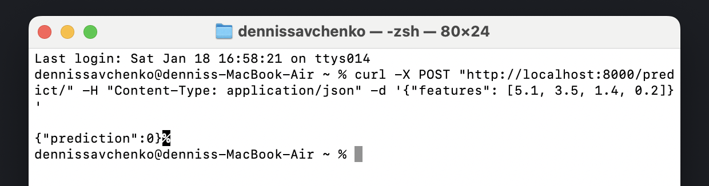

# Dockerized API with a Predictive Model

## Project Overview
This project demonstrates the creation of a **Dockerized API** with a simple predictive model. The model is an **Iris Classifier**, trained using the `scikit-learn` library and saved in the `.joblib` format. The API is implemented using the `FastAPI` framework and is capable of receiving prediction requests and returning the predicted Iris class based on the input attributes.

---

## Steps and Details

### 1. Model Training and Testing
- **Model**: A simple classifier for the Iris dataset.
- **Training**: The model is trained using the `RandomForestClassifier` from `scikit-learn`.
- **Saving**: After training, the model is saved as `model.joblib` using the `joblib` library.
- **Testing**: The script includes code to evaluate the model's accuracy.

---

### 2. API Development
The `app.py` script defines a simple API application:
- **Endpoints**:
  - `/`: Sends a welcome message.
  - `/predict/`: Accepts a POST request containing Iris attributes and returns the predicted Iris class.
- **Request Body**:
  - A JSON object containing a list of numerical attributes corresponding to the Iris dataset features.

---

### 3. Dockerization
The application is containerized using Docker for easy deployment:
1. A `Dockerfile` is created to define the environment, install dependencies, and run the API.
2. The container is built and tested locally to ensure functionality.

### 4. Docker Hub
After testing the local image it was sent to the Docker Hub

